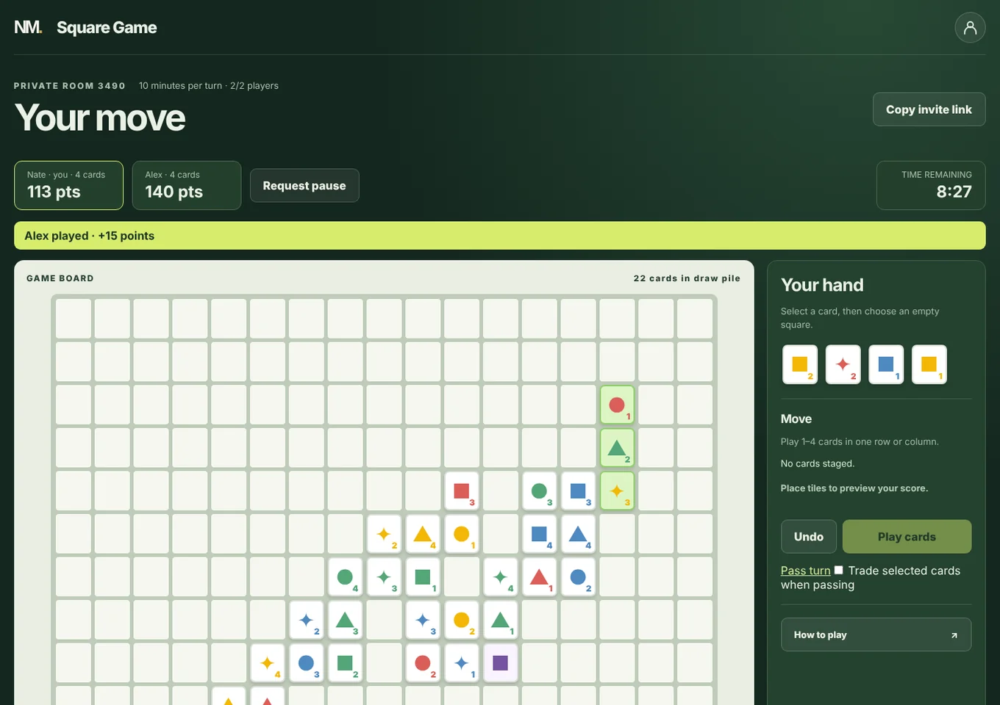

# Square Game

A free, two-player online card game based on the board game [Iota](https://www.ultraboardgames.com/iota/game-rules.php). Play a friend or a bot, take turns over minutes or days, and review the game when it ends.

**Play it at [nathanielmann.ca/square-game](https://nathanielmann.ca/square-game).**



## Why I built it

This summer, I really enjoyed playing a board game called Iota with my family. When I left for school, I wanted to keep playing, so I made an online version of it. It adds some features inspired by chess.com, like multi-day turns and post-game stats.

## Features

- Private rooms shared by invite link or four-digit code. Guests can play without an account.
- Turn timers of 1–10 minutes, or 1, 2, 3 or 7 days. Day-length games email each player when it's their turn, with a reminder two hours before the deadline.
- A bot opponent with four difficulties, from Easy to Insane.
- A custom wild card exchange rule, with 0–10 wild cards per deck.
- A post-game review with per-player averages, best and worst turns, a points-per-turn chart and a card placement log.
- Passwordless sign-in with an emailed code, plus account stats, current games, a display name and an icon colour.
- Pausing by mutual agreement, emailed invites and a four-part tutorial.

## Tech stack

| Part | Tech |
| --- | --- |
| Server | Node.js 20 using only built-in modules (no npm dependencies) |
| Browser | Vanilla JavaScript, HTML and CSS |
| Storage | Supabase Postgres through its REST API, or a local JSON file in development |
| Email | Resend's HTTPS API |
| Hosting | A Render web service for the API. The browser files are served by the [homepage](https://nathanielmann.ca) static site. |
| Tests | Node's built-in test runner (`node --test`) |

## How it works

- **The server is the referee.** The browser only proposes a move, a pass or a wild exchange. The server holds the deck, hands, board, turn deadline and scores. It checks turn ownership, card ownership, placement, row and column rules, wild consistency and every affected line, then calculates the score itself. Fabricated cards and client-supplied scores are rejected, and each player only ever receives their own hand.
- **Moves can't collide.** Every room save includes the version it was based on, so if two requests race, only one can commit.
- **No passwords are stored.** Sign-in uses a six-digit email code that expires after ten minutes and works once. Sessions are signed tokens. Login codes are stored hashed, and no player email or token appears in public room state.
- **Personal turn links.** Turn emails contain a link that signs the player in and opens the room. It is bound to that room and player, and expires at the turn deadline or after seven days.
- **The bot can't cheat.** It only sees what a player could see: the board, its own hand and card counts (`aiObservation` in `ai.js`). Easy and Medium deliberately play weaker legal turns. Hard maximizes the immediate turn score. Insane counts unseen cards and compares strong turns against sampled opponent replies and next-turn simulations. Strategy runs in a worker thread so it doesn't block the server.
- **Consistent wild cards.** After every move, the server gives each wild card one identity that works across all of its lines. It may reinterpret a wild on a later turn if needed.

## Rules

Each player has four cards. On your turn, place one to four cards in a single row or column, keeping every line to at most four cards. Within a line, colour, shape and number must each be either all the same or all different. Playing all four cards doubles the turn score, and the final move doubles when a player empties their hand after the deck runs out. Wild cards are worth zero.

**Wild exchange (custom rule).** The host picks 0–10 wild cards when creating a room (two by default), so a deck holds 64–74 cards. Existing rooms keep the deck they started with. Before your main move, you may select a regular card from your hand and click a wild card on the board to swap them, as many times as there are wilds. Each legal swap scores every line through the replaced card as if you had placed it, and the wild card goes into your hand. Line points from all exchanges and the main move are added together, and every four-card line ("lot") in any of them doubles the combined total. For example, two lots across exchanges plus one lot in the main move scores `(exchange points + move points) × 2 × 2 × 2`.

## Run locally

Requires Node.js 20 or newer. There are no npm packages to install.

```bash
npm start
```

Open `http://localhost:10000/square-game`. Use two browser profiles to create and join a room, or choose **Play against a bot**.

Local development stores rooms in `data/rooms.json`, account profiles in `data/account-profiles.json`, and the session signing key in `data/account-secret`, all ignored by Git. Minute-length games, guests and bots work with no configuration. Email sign-in, invites and day-length games need the services in [Deploy on Render](#deploy-on-render). Copy `.env.example` to set them locally.

## Tests

```bash
npm test
```

The tests in `test/` cover the game rules and scoring, the bot, accounts and sessions, turn links, email, reminders, room controls, the post-game review and the tutorial.

## Limitations

- Two players per room, and no matchmaking.
- The Insane bot uses bounded search, so it isn't guaranteed to play perfectly. Bot games use minute timers.
- Render's free plan sleeps when idle, so opening an email link can hit a slow cold start. Local file storage doesn't survive a Render restart.
- If an email fails to send, the move is still saved. The page reports the failure so the player can share the link by hand.
- Day-length games, email sign-in and invites only work once Supabase, Resend and `ACCOUNT_SECRET` are configured.

## Project structure

| Path | Purpose |
| --- | --- |
| `game.js` | Rules, turn progression and scoring |
| `ai.js`, `ai-runner.js`, `ai-worker.js` | Bot strategy and the worker thread that runs it |
| `server.js` | HTTP API and static files |
| `store.js` | Local development storage, or Supabase REST storage with version checks |
| `account.js` | Sign-in codes, signed sessions and turn links |
| `mail.js`, `email-template.js` | Resend emails: sign-in codes, turns, reminders, invites and the homepage feedback form |
| `reminders.js`, `reminder-schedule.sql` | Two-hour reminders for day-length turns |
| `schema.sql`, `migrations/` | Supabase tables |
| `public/` | Browser UI, including `tutorial.js` |
| `test/` | Tests |

## Game details

**Rooms and timers.** The default timer is 2 minutes. The host chooses 1–10 minutes or 1, 2, 3 or 7 days. Day-length rooms require both players to sign in, durable storage and email. The countdown is enforced when a room is next opened or used, and by the optional reminder scheduler for day-length turns. The host can delete a waiting room before anyone joins.

**Invites.** While a room is waiting, the host can email up to three invites containing the general room link and code. When someone joins, the host gets an email with their personal rejoin link. Hosts who created the room without an email are asked for one when sending the first invite. The general invite link has no player token, so it is safe to share with the intended opponent. A personal rejoin link works like a password for minute-length games; day-length games also require the matching signed-in account.

**Accounts.** The browser remembers sign-in for a year with a signed account token, renewed whenever the account loads. Older 30-day sessions upgrade automatically. Signing out, clearing browser storage or a year without use requires a new code. Verified accounts are attached to rooms created or joined while signed in, and existing rooms in the same browser are linked when their room tokens are available. A typed email alone never attaches a room. Signed-in players set a display name and icon colour in the account tab. Names don't need to be unique, and guests still type a name for each room. The landing page shows win rate, games played and current games.

**Pausing.** Either player can request a pause, which starts when the opponent accepts. The timer keeps running until then, and a turn ending clears the request. While paused, moves and timeouts stop. Both players must agree to resume, which restores the remaining turn time.

**Post-game review.** Turn history is stored in the room and only made public once the game ends. Averages include passes and timeouts, card counts include wild replacements, and the automatically dealt opening card isn't counted for either player. Select a turn to highlight its cards on the final board, or select a board card to see who placed it. Games created before this feature show an incomplete-history notice.

**Tutorial.** The first visit in each browser opens a four-part tutorial, and the header's **How to play** button reopens it. It remembers that it has been seen with the `square-tutorial-seen-v1` local-storage key. Its boards use the game's own tile renderer, with no image assets.

## Deploy on Render

1. Create a Supabase project. Run [`schema.sql`](schema.sql) in its SQL editor, and get the project URL and a **secret** API key. The secret key must never go in browser code or Git.
2. Create a Resend API key and verify a sender domain or address. Email uses Resend's HTTPS API because Render's free web services block outbound SMTP ports 25, 465 and 587.
3. Create a Render Blueprint from [`render.yaml`](render.yaml). It creates a Node web service. Keep its `onrender.com` URL for the homepage's API configuration.
4. Set these environment variables in Render:

   | Variable | Value |
   | --- | --- |
   | `SUPABASE_URL` | Your Supabase project URL |
   | `SUPABASE_SECRET_KEY` | Your server-only secret key |
   | `RESEND_API_KEY` | Your Resend API key |
   | `EMAIL_FROM` | A verified sender, such as `Square Game <games@example.com>` |
   | `ACCOUNT_SECRET` | A random, private secret of at least 32 bytes for signing account sessions |
   | `BASE_URL` | `https://nathanielmann.ca/square-game` (set in `render.yaml`) |

5. If the game was already deployed, rerun the updated `schema.sql`. Open `/square-game/health` on the game service and check that `durableStorage`, `emailConfigured` and `accountConfigured` are all `true`. Then test sign-in and a 1-day room with two email addresses through the public domain.

If email sign-in reports `PGRST205` for `public.square_account_profiles`, run [`migrations/20261003_account_profiles.sql`](migrations/20261003_account_profiles.sql) in the SQL editor of the Supabase project set by `SUPABASE_URL`, then retry. It creates the profile table, restricts it to the service role and reloads the REST schema cache. Existing profiles are kept.

**Homepage client.** The `nathanielmann.ca` homepage is a separate Render static site. It hosts a copy of this repo's browser files under `/square-game` and calls this service's API. Set the homepage's `GAME_API_ORIGIN` to this service's `onrender.com` origin. After changing anything in `public/`, run `node sync-game.js` in the homepage repo and deploy both. This service doesn't claim the root domain.

### Two-hour email reminders

An optional [Supabase Cron schedule](reminder-schedule.sql) checks every minute and calls the game service only when a day-turn reminder is due or a day turn has expired. It needs no paid Render cron service. Reminders are sent at the first check with two hours or less remaining, so cold starts or outages can delay them. Waiting, paused, finished, expired and minute-length turns get no reminders, and resuming a turn that already had one doesn't send another.

To enable it after deploying the backend:

1. Set `REMINDER_SECRET` on the Render web service to a new random secret of at least 32 characters, different from `ACCOUNT_SECRET`.
2. In Supabase Vault, create `square_reminder_secret` with the same value, and `square_reminder_url` with `https://YOUR-GAME-SERVICE.onrender.com/square-game/api/reminders/run`. Use the backend address, not the homepage.
3. Run [`reminder-schedule.sql`](reminder-schedule.sql) in the Supabase SQL editor as the project administrator. It enables `pg_cron` and `pg_net` and creates one named job. Rerunning it updates that job.
4. Monitor the `square-game-reminders` job and `net._http_response`. The endpoint returns counts of sent reminders, advanced rooms and failures. A failure returns HTTP 503 and is retried on the next check.

Delivery markers are stored in the room. Resend idempotency keys prevent duplicate emails after retries, and the scheduler rechecks the room and uses version checks so it can never overwrite a move. To turn it off, run `select cron.unschedule('square-game-reminders');`.
